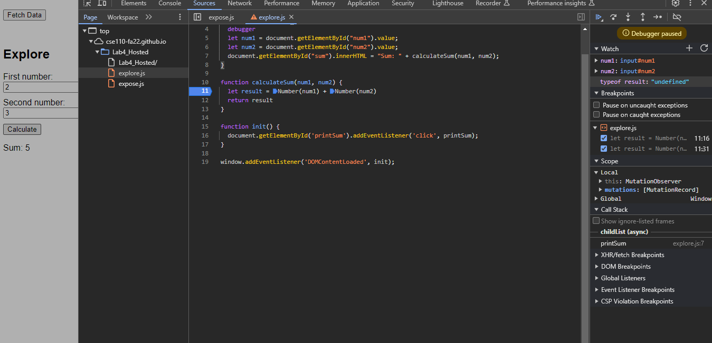

# Explore - Part 2
## 1. 
 The bug was the function `calculateSum` recognize `num1` and `num2` as string, so it perform `num1 + num2` as string concatenation instead of adding.
## 2. 
I would fix it by type casting `num1` and `num2` as `Number`.
